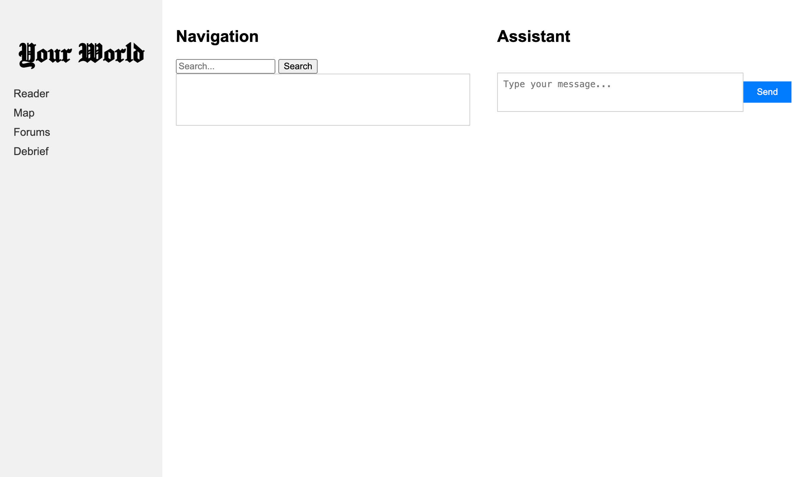

# Your World

`Your World` is a site dedicated towards making navigating news publications with the help of a large language model. We envision a different way of interacting with traditional news media where getting a broader understanding of an issue is possible without having to read a large quantity of articles; and finding articles relevant to your curiosities is easier than ever.

The tool pulls from a large database of news sources using API requests. A language model handles the API requests and can summarize, compare, translate, and do other operations on entries in the database to serve the most relevant articles and takeaways based on user requests. 

This is still a work in progress.